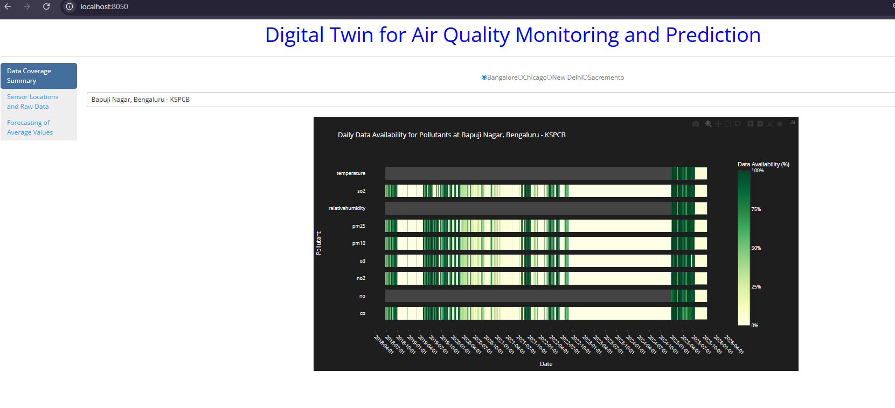

This repo contains a digital twin to monitor the level of air pollutants at chosen cities: Chicago and Sacremento.
To view the digital twin on your machine do as follows.

The digital twin is hosted using Azure at https://aqdigitaltwin-fyeshgfbc7h6aje8.centralus-01.azurewebsites.net/

The landing page is as follows

